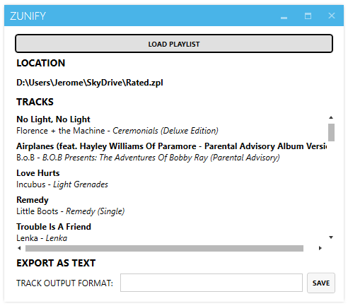
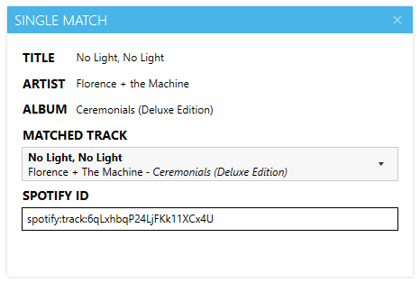

Zunify
======

A tool to parse Zune playlists (.zpl) and export them to other formats: text listings of songs, or Spotify IDs that can be copy-pasted into the desktop client.

## Text Export
Entire playlists can be converted to plain text listings of all the songs within. These can be specified using a custom string, with the following format specifiers:

	$Title - Track title
	$Artist - Track artist
	$AlbumTitle - Album name
	$AlbumArtist - Album artist

For instance, `$Title - $Artist`. (Strings without spaces like `$Title, $AlbumTitle, $AlbumArtist` don't work for now.)

## Spotify IDs
You can also match individual songs to corresponding tracks on the Spotify service. Double-clicking a song will bring up this window:

Just copy-paste the text from the `SPOTIFY ID` box into the desktop client to import the track.

Alternative matches can be chosen from the `MATCHED TRACK` drop-down.

## TODO
* Matching an entire playlist with tracks on Spotify and exporting the result.